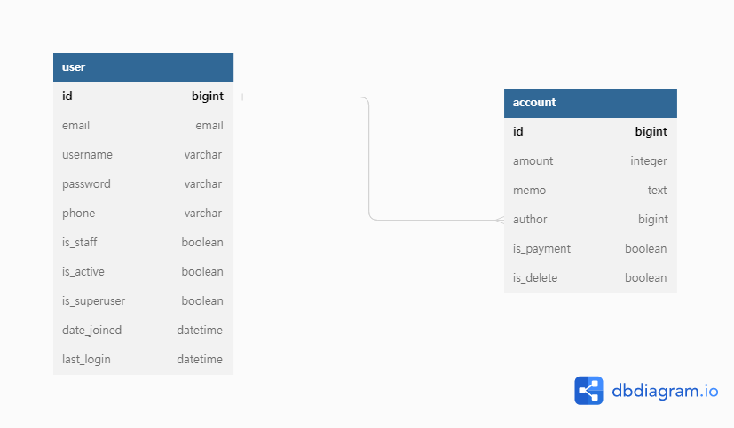
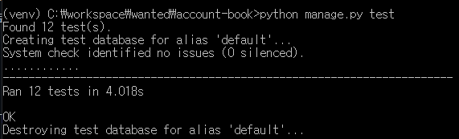

# :dollar: account-book
본인의 소비내역을 기록/관리하는 서비스

# :bookmark_tabs: 목차
* [개발 기간](#calendar-개발-기간)
* [프로젝트 개요](#books-프로젝트-개요)
    * [프로젝트 설명](#page_facing_up-프로젝트-설명)
    * [프로젝트 요구사항](#clipboard-프로젝트-요구사항)
    * [사용 기술](#hammer-사용-기술)
    * [모델링](#floppy_disk-모델링)
    * [API Test](#hourglass_flowing_sand-api-test)
    * [프로젝트 분석](#mag_right-프로젝트-분석)
* [API Endpoint](#pushpin-api-endpoint)
    * [User](#user)
    * [Account](#account)

# :calendar: 개발 기간
2022.11.03. ~ 2022.11.04.

# :books: 프로젝트 개요
## :page_facing_up: 프로젝트 설명
요구사항을 만족하는 백엔드 서비스 개발

## :clipboard: 프로젝트 요구사항
1. 고객은 이메일과 비밀번호 입력을 통해서 회원가입을 할 수 있습니다.
2. 고객은 회원 가입이후, 로그인과 로그아웃을 할 수 있습니다.
3. 고객은 로그인 이후 가계부 관련 아래의 행동을 할 수 있습니다.
   * 가계부에 오늘 사용한 돈의 금액과 관련된 메모를 남길 수 있습니다.
   * 가계부에서 수정을 원하는 내역은 금액과 메모를 수정할 수 있습니다.
   * 가계부에서 삭제를 원하는 내역은 삭제를 할 수 있습니다.
   * 삭제한 내역은 언제든지 다시 복수 할 수 있습니다.
   * 가계부에서 이제까지 기록한 가계부 리스트를 볼 수 있습니다.
   * 가계부에서 상세한 세부 내역을 볼 수 있습니다.
4. 로그인하지 않은 고객은 가계부 내역에 대한 접근 제한 처리가 되어야 합니다.

## :hammer: 사용 기술
* Back-End: Python, Django, Django REST Framework
* Database: SQLite
* ETC: Git, Github

## floppy_disk: 모델링

* `User(사용자)`, `Account(가계부)` 모델링
* `User(사용자)`와 `Account(가계부)`은 1:N관계

## :hourglass_flowing_sand: API Test
* 유저관리: 이메일을 ID로 회원가입, 로그인 등 테스트 코드 작성
* 가계부: 작성 실패, 작성, 가계부 목록, 삭제, 복구 등 테스트 코드 작성

## :mag_right: 프로젝트 분석
* `users`, `accounts` 2개의 앱으로 분리하여 관리
* 유저 관리
    * 회원가입: 추후 JWT 토큰 발급
    * 로그인: JWT 토큰을 이용한 인증
* 가계부 관리
    * 가계부 생성
        * 금액과 메모 필요 등 필요
        * 추수 `is_payment`로 지출/수입 관리
    * 가계부 삭제 및 복구
        * 작성한 가계부를 is_delete를 이용한 삭제/복구 구현

# :pushpin: API Endpoint
## User
|URL|Method|Action|Description|
|:---|:---:|:---:|:---|
|/api/v1/users/register/|POST|-|사용자 회원가입|
|/api/v1/users/login/|POST|-|사용자 로그인|
|/api/v1/users/logout/|POST|-|사용자 로그아웃|
|/api/v1/users/|GET|List|사용자 목록(staff)|
|/api/v1/users/{pk}/|GET|Retrieve|사용자 상세|
|/api/v1/users/token/refresh/|POST|-|refresh 토큰을 통한 access 토큰 재발급|

## Account
|URL|Method|Action|Description|
|:---|:---:|:---:|:---|
|/api/v1/accounts/|POST|-|가계부 생성|
|/api/v1/accounts/|GET|List|가계부 목록|
|/api/v1/accounts/{pk}/|GET|Retrieve|가계부 상세|
|/api/v1/accounts/{pk}/|PUT|Update|가계부 갱신|
|/api/v1/accounts/{pk}/|DELETE|Delete|가계부 삭제|
|/api/v1/accounts/restoration/|GET|List|가계부 삭제 목록|
|/api/v1/accounts/restoration/{pk}/|GET|Retrieve|삭제된 가계부 상세|
|/api/v1/accounts/restoration/{pk}/|PUT|Update|삭제된 가계부 복구|
